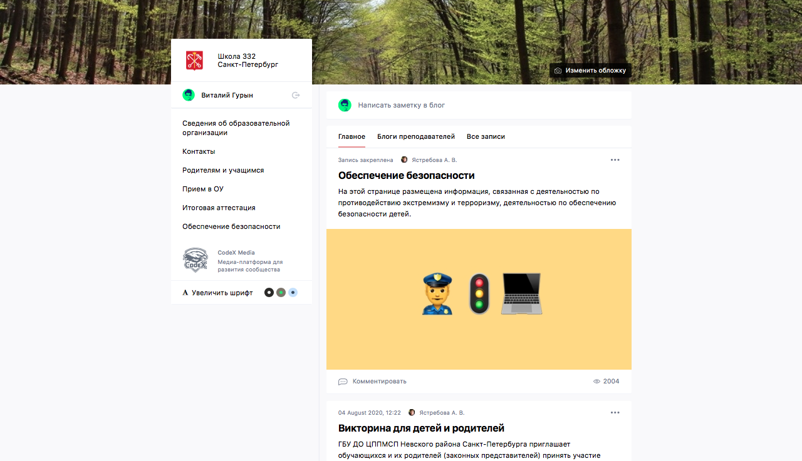
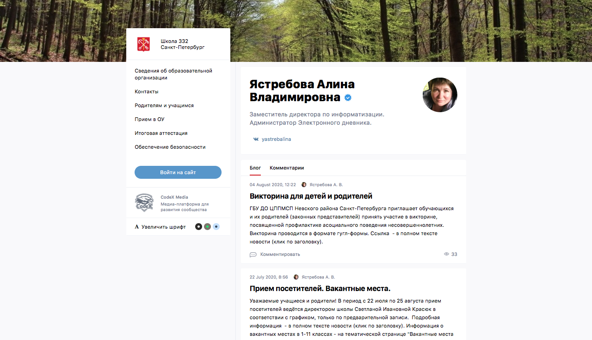
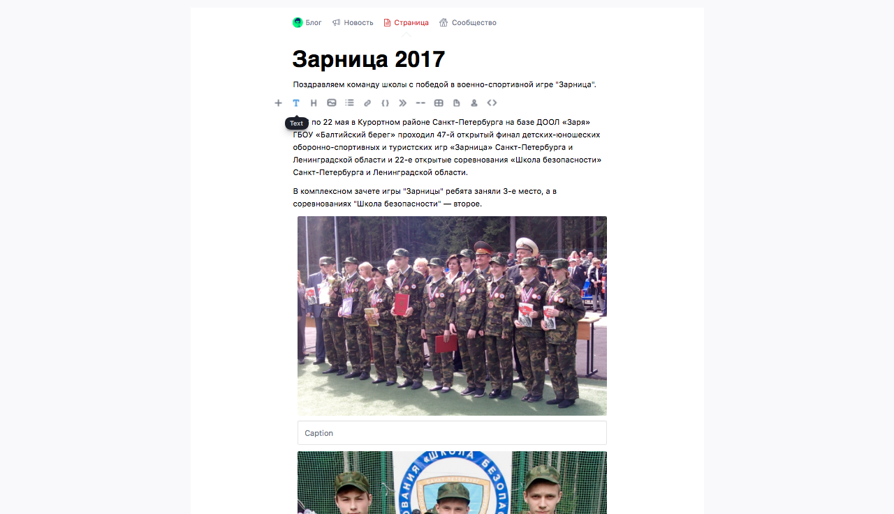

# CodeX Media

Open source platform for building UGC media

https://codex.so/media

## How to run

Check out [deployment](docs/deployment.md) guide to run your own site on the engine.
 
If you want to contribute CodeX Media see [development](docs/development.md) guide. 

## Contributing

This open source project is created and maintained by enthusiasts. 

Feel free to report any problems to [issues](https://github.com/codex-team/codex.media/issues/new).

For a new feature requesting also create an issue to discuss and prove the need. 

Know how to fix any bugs? Open a pull request with changes.

## Sites on this engine

We are glad to introduce a couple of sites that are pleasured to use CodeX Media engine.

- https://school332.ru — School 332 — Saint-Petersburg, Russia
- https://school181.ru — School 181 — Saint-Petersburg, Russia

Join this list! For any help you can write to us [team@codex.so](mailto:team@codex.so)